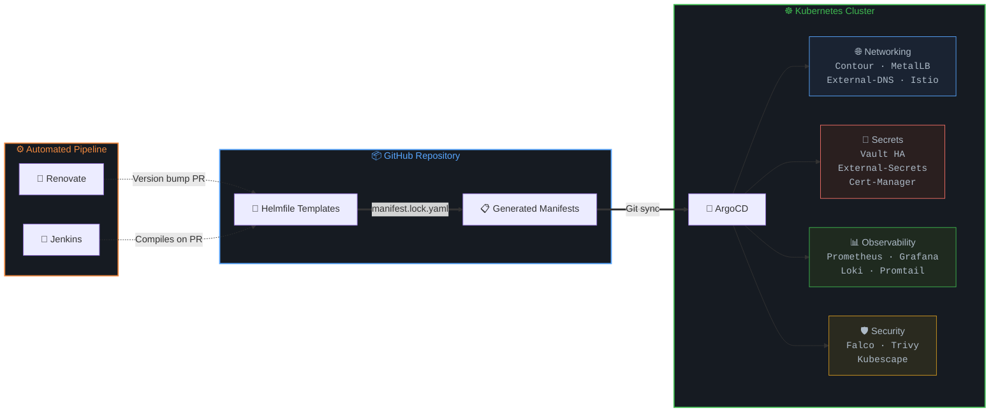
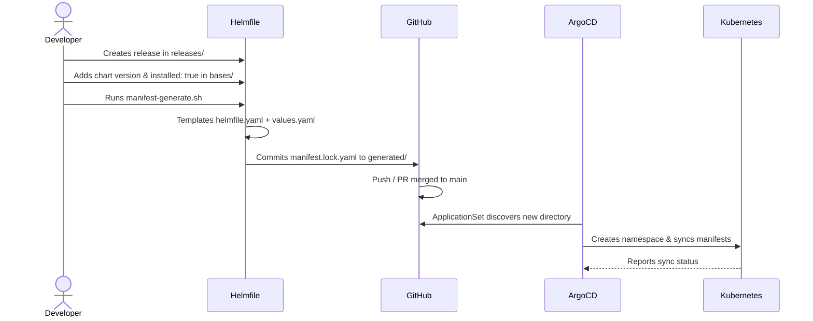
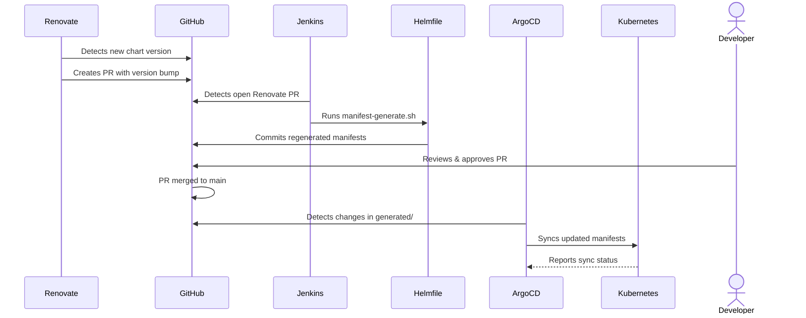
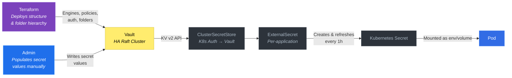
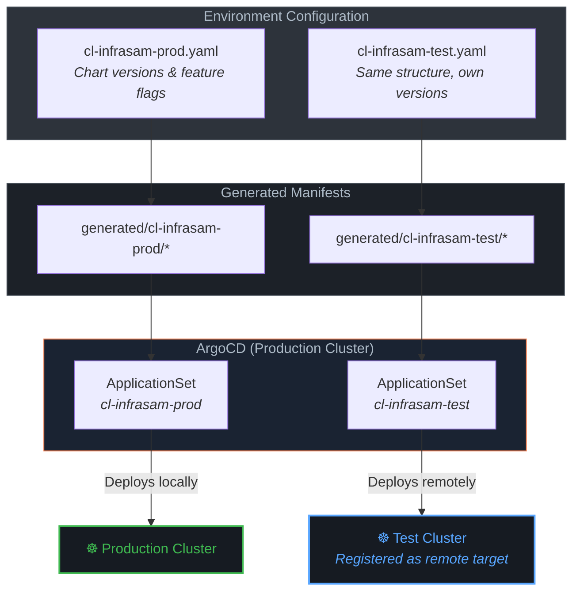

# Kubernetes GitOps Platform


A fully automated **GitOps platform** for Kubernetes, built on **ArgoCD**, **Helmfile**, and **Helm**. All infrastructure is declared as code, with automated dependency updates, centralized secret management via **HashiCorp Vault**, and a complete observability stack. The platform supports **multi-cluster** deployments through environment-based configuration.

---

## Architecture Overview



---

## GitOps Workflow

The platform uses a **pre-rendered manifest pattern** — Helmfile templates are compiled into static YAML before ArgoCD deploys them. This decouples templating from deployment and provides a clear audit trail in Git.

### Initial Deployment (manual)

A new application is added by creating a Helmfile release under `releases/`, defining its chart version and enabling it in the environment config (`bases/environments/`), then generating manifests locally.



### Automated Updates (Renovate + Jenkins)

Once deployed, chart versions are kept up to date automatically.



**How it works:**

1. A new release is added under `releases/` and manifests are generated locally via `manifest-generate.sh`
2. ArgoCD **ApplicationSet** auto-discovers the new `generated/<cluster>/<app>/` directory and deploys it
3. Going forward, **Renovate** scans Helm registries hourly and creates version bump PRs
4. **Jenkins** picks up Renovate PRs, regenerates manifests, and commits them back to the branch
5. A developer **reviews and approves** the PR before merge
6. After merge, **ArgoCD** syncs the updated manifests to the cluster

---

## Infrastructure Components

### GitOps & Delivery

| Component | Description |
|-----------|-------------|
| **ArgoCD** | GitOps controller using ApplicationSet for dynamic app discovery from `generated/` directories |
| **Jenkins** | Runs the manifest regeneration pipeline when Renovate creates dependency update PRs |
| **Renovate** | Scans Helm chart registries hourly and creates automated version bump PRs |

### Networking & Ingress

| Component | Description |
|-----------|-------------|
| **Contour** | Envoy-based ingress controller handling HTTPS routing for all exposed services |
| **MetalLB** | Bare-metal load balancer providing external IPs via L2 advertisement |
| **External-DNS** | Syncs Kubernetes ingress records to Cloudflare DNS automatically |
| **Istio** | Service mesh in ambient mode providing mTLS and traffic management without sidecars |

### Security & Secrets

| Component | Description |
|-----------|-------------|
| **Vault** | HA secret store (3-replica Raft cluster) — structure and configuration owned by Terraform in a separate repository |
| **External-Secrets** | Operator syncing secrets from Vault into Kubernetes via ClusterSecretStore |
| **Cert-Manager** | Automated TLS certificates via Let's Encrypt with Cloudflare DNS-01 validation |
| **Falco** | Runtime threat detection and security monitoring |
| **Trivy** | Container image vulnerability scanning |
| **Kubescape** | Kubernetes security posture and compliance scanning |

### Observability

| Component | Description |
|-----------|-------------|
| **Prometheus + Grafana** | Metrics collection and visualization via kube-prometheus-stack |
| **Loki + Promtail** | Log aggregation with Promtail collecting logs from all nodes |

---

## Repository Structure

```
.
├── bases/                          # Shared configuration
│   ├── environments/               # Per-cluster settings and chart versions
│   │   ├── cl-infrasam-prod.yaml   #   Production cluster config
│   │   └── cl-infrasam-test.yaml   #   Test cluster config
│   ├── helmDefaults.yaml           # Global Helm behavior (atomic, timeout)
│   └── environments.yaml           # Environment-to-cluster mapping
│
├── releases/                       # One directory per application
│   ├── argocd/                     #   Includes ApplicationSet & AppProject definitions
│   ├── vault/                      #   HA Vault with Raft storage
│   ├── external-secrets/           #   ClusterSecretStore for Vault integration
│   ├── kube-prometheus-stack/      #   Prometheus, Grafana, Alertmanager
│   ├── istio/                      #   Base, Istiod, CNI, Ztunnel
│   └── .../                        #   Each release has helmfile.yaml + values.yaml
│
├── charts/                         # Reusable local Helm charts
│   ├── es-secrets/                 #   ExternalSecret template (used by 6+ releases)
│   └── grafana-dashboards/         #   Grafana dashboard provisioning
│
├── generated/                      # Pre-rendered manifests (ArgoCD reads from here)
│   └── cl-infrasam-prod/           #   One manifest.lock.yaml per application
│
├── pipelines/                      # CI/CD pipeline definitions
│   └── Jenkinsfile.renovate        #   Manifest regeneration for Renovate PRs
│
└── manifest-generate.sh            # Helmfile → manifest compilation script
```

---

## Secret Management

All application credentials are managed through **Vault** and delivered to pods via **External-Secrets Operator**. No secrets are stored in Git.

**Terraform** (in a separate repository) owns the Vault structure — it deploys the secret engine mounts, policies, auth methods, and the folder hierarchy for each application. The actual secret values are then populated manually.



Applications using Vault secrets include Jenkins, Renovate, Cert-Manager, External-DNS, and Grafana — each with dedicated ExternalSecret resources created via a shared `es-secrets` Helm chart template.

---

## Multi-Cluster Support

The platform is designed for multi-cluster operations. Each cluster gets its own environment configuration, generated manifests, and ArgoCD AppProject — following the same pattern. Test clusters can be registered as remote targets in the production cluster's ArgoCD, allowing infrastructure components to be pushed out to guest clusters from a single control plane.



**Adding a new cluster** requires only:
1. A new environment file in `bases/environments/`
2. A new ArgoCD AppProject and ApplicationSet entry
3. Registering the cluster as a remote target in ArgoCD
4. Running `manifest-generate.sh` for the new environment

---

## Key Design Decisions

- **Pre-rendered manifests** — Helmfile compiles templates into static YAML (`manifest.lock.yaml`) committed to Git, giving ArgoCD a clean source of truth and full diff visibility
- **ApplicationSet pattern** — A single ApplicationSet per cluster auto-discovers applications from the `generated/` directory structure, eliminating manual Application creation
- **Multi-cluster via environment files** — Each cluster is a separate Helmfile environment with its own chart versions and feature flags, enabling independent lifecycle management
- **Reusable ExternalSecret chart** — A shared `es-secrets` Helm chart templates ExternalSecret resources across all applications, ensuring consistent Vault integration
- **Automated dependency lifecycle** — Renovate detects updates, Jenkins regenerates manifests, and ArgoCD deploys — reducing manual maintenance to PR review and merge
